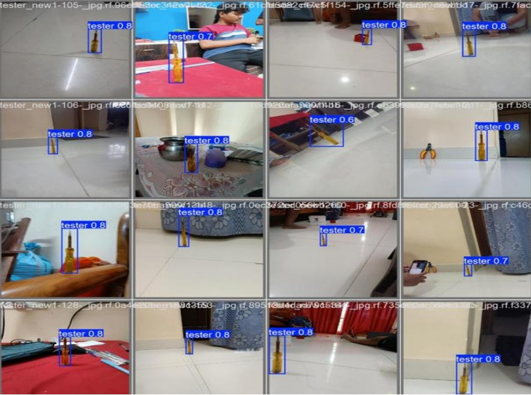

# 🎯 Real-Time Object Detection using YOLOv8

This project performs **real-time object detection** using the **YOLOv8 model** and your system’s webcam.

---

## 🧠 Features
- Uses **Ultralytics YOLOv8** for fast and accurate detection  
- Displays live video feed with detected objects  
- Press **'q'** to exit the live window  

---
## 🖼️ Project Output




## ⚙️ Requirements
Install dependencies:
```bash
pip install ultralytics opencv-python
